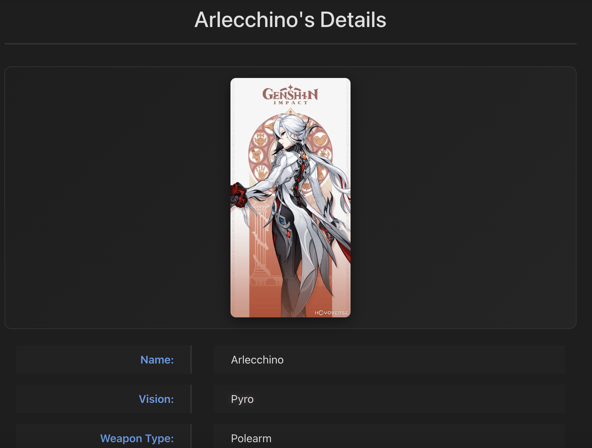
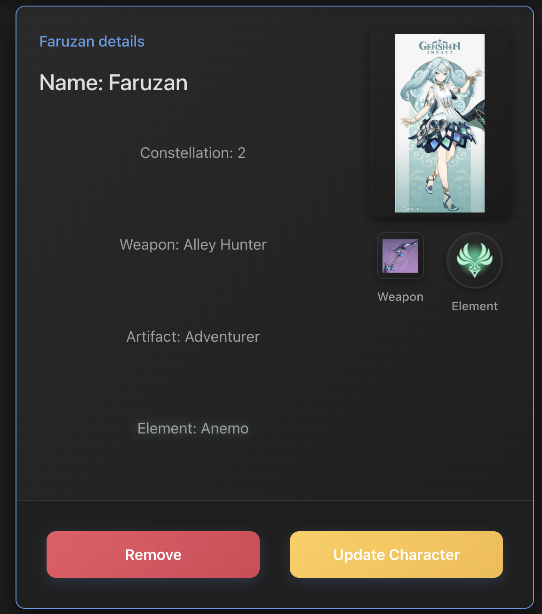
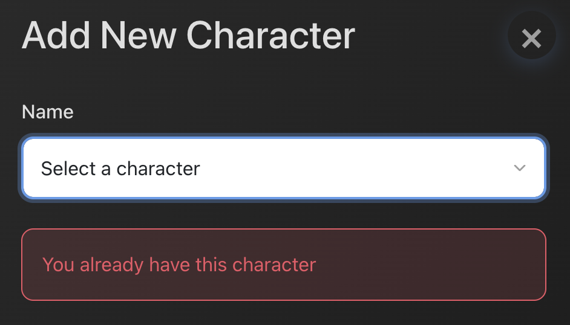

# Genshin Impact Character Tracker

## List of Content

1. Application Overview
2. Key Features
3. Technology Stack
4. API Usage
5. Component Tree
6. Browser / App Usage
7. Environment variables

## Application Overview

The Genshin Impact Character Tracker is a comprehensive React-based web application that allows players to manage their obtained characters from the popular game Genshin Impact. This application features real-time data fetching from external APIs, and CRUD (Create, Read, Update, Delete) functionality for user-owned characters.

## Key Features

- Character Database: Browse all Genshin Impact characters with detailed information

  

- Weapon Database: View all available weapons in the game

- Personal Collection: Track your obtained characters with constellation levels, equipped weapons, and artifacts

- Modal-based Editing: Add and update characters using intuitive modal interfaces

## Technology Stack

1. React
2. React Router
3. TanStack Query (React Query)
4. Airtable

## API Usage

1. Genshin Impact API: External API for character/weapon data and images

   > https://github.com/genshindev/api

2. Backend API (In Airtable): Custom endpoints for managing user's character collection

## Project Structure - Component Tree

## Browser/App Usage

1. Homepage - Landing Page

> Homepage search interface
> 

- Search for a Character by typing the Character's name in the search bar
- Navigate to the relevant pages using the Navigation bar at the top

  > Smart feature
  > 

  - Submitting an invalid name in the search bar will result in an error message

2. All Characters / All Weapons page

> Browsing Character/Weapon List

> 
>
> - Hovering above a character will indicate possible selection

> 
>
> - Hovering above a weapon will indicate possible selection

> 
>
> - Clicking on the respective Characters/Weapons will navigate users to the page which provides details of the selection

3. User Characters Page

The User can use this interface to track which characters have been collected, as well as the attached weapons, artifacts and character constellations.

Each character has a namecard which displays the characters element(vision), the equipped weapon and artifact, as well as the constellation level.

**CRUD FEATURES**

1. Add a new character

   

   Upon clicking the 'Add' button, the user has to select the new Character obtained.

   

   Only after selecting the character will the other fields appear for selection.

   > Smart Features:

   1. If character is already in the lineup, it cannot be added again

   

   2. Every character can only wield specific types of weapons. If a weapon of incorrect type is selected, the user will be informed that it cannot be equipped.

   

   3. If not all fields are filled in, the user will be reminded to do so, and cannot submit their new entry.

   

2. Updating a character

Upon clicking 'Update', the user will be brought to an update portal.

Only the constellation, weapon and artifact entries can be changed. (If the character name is to be edited implies that the character was keyed in wrongly, hence, the user simply needs to delete the existing incorrect character).

Similar to the 'Add' portal, if an incorrect weapon type is selected, the user will be informed that the weapon cannot be equipped.

3. Deleting a character

Clicking the 'Delete' button will remove the character from the 'My Characters' list.

# Environment Variables

1. Airtable bearer token key (VITE_AIRTABLE_API_KEY) - For Authorization purposes
2. Airtable information (VITE_AIRTABLE_BASE_URL) - For accessing user's acquired characters
3. Genshin External API (VITE_EXT_BASE_URL) - Accessing all data on genshin (Link stated in API Usage 1)
